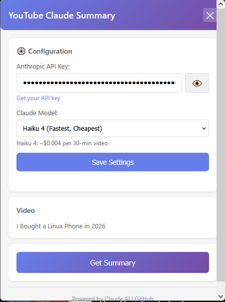
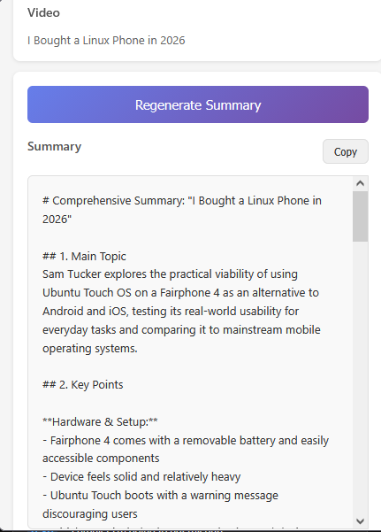
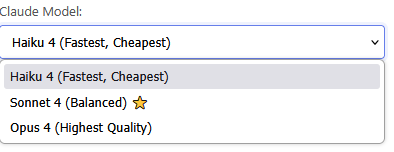

# YouTube Claude Summary

A Firefox browser extension that extracts YouTube video transcripts and generates AI-powered summaries using Claude by Anthropic.

**Current Version:** 1.2.0

## Features

- **Automatic Transcript Extraction** - Extracts transcripts from YouTube videos
- **AI-Powered Summaries** - Uses Claude to generate comprehensive summaries
- **Model Selection** - Choose between Haiku 4, Sonnet 4, or Opus 4
- **Smart Caching** - Summaries cached per tab/video for instant retrieval
- **Privacy-Focused** - Your API key stored locally; no data sent to third parties
- **Cost-Effective** - Use your own Anthropic API key (typically pennies per video)
- **Clean Interface** - Simple, intuitive popup design with collapsible settings

---

## Table of Contents

- [Quick Start](#quick-start)
- [Installation](#installation)
- [Usage](#usage)
- [Model Selection Guide](#model-selection-guide)
- [Features in Detail](#features-in-detail)
- [Privacy & Security](#privacy--security)
- [Costs](#costs)
- [Troubleshooting](#troubleshooting)
- [Customization](#customization)
- [Contributing](#contributing)
- [Changelog](#changelog)

---

## Quick Start

### Get Running in 5 Minutes

1. **Get your Anthropic API key** ([console.anthropic.com/settings/keys](https://console.anthropic.com/settings/keys))
2. **Install the extension:**
   - Firefox: `about:debugging#/runtime/this-firefox`
   - Click "Load Temporary Add-on"
   - Select `manifest.json`
3. **Configure:**
   - Click the extension icon
   - Enter your API key
   - Choose your model (Sonnet 4 recommended)
   - Click "Save Settings"
4. **Use it:**
   - Go to any YouTube video with captions
   - Click the extension icon
   - Click "Get Summary"
   - Done! 

---

## Installation

### Method 1: Temporary Extension (Quick Testing)

1. Download or clone this repository
2. Open Firefox and navigate to: `about:debugging#/runtime/this-firefox`
3. Click "Load Temporary Add-on..."
4. Navigate to the extension folder and select `manifest.json`
5. The extension is now loaded!

**Note:** Temporary extensions are removed when Firefox closes.

### Method 2: Permanent Installation (Unsigned)

For personal use with unsigned extension:

1. **Enable unsigned extensions:**
   - Type `about:config` in Firefox
   - Search for `xpinstall.signatures.required`
   - Set to `false`

2. **Package the extension:**
   ```bash
   cd youtube-claude-summary
   zip -r youtube-claude-summary.xpi *
   ```

3. **Install:**
   - Drag the `.xpi` file into Firefox
   - Click "Add"

### Method 3: Firefox Add-ons Store (Future)

To make it publicly available, submit to [addons.mozilla.org](https://addons.mozilla.org/) for review.

---

## Usage

### Initial Setup

1. Click the extension icon in your Firefox toolbar
2. Enter your Anthropic API key
3. (Optional) Select your preferred Claude model
4. Click "Save Settings"

### Generating Summaries

1. Navigate to any YouTube video with captions/transcripts
2. Click the extension icon
3. Click "Get Summary"
4. Wait 10-30 seconds (depending on video length and model)
5. Read your AI-generated summary!
6. Click "Copy" to copy to clipboard

### Configuration Management

**Collapsed View:**
```
🔑 API Key Configured  [Sonnet 4]    [Edit]
```

**Expanded View:**
- Click "Edit" to change API key or model
- Select model from dropdown
- See cost estimates
- Click "Save Settings"

### Summary Format

Each summary includes:
- **Main Topic** - What the video is about
- **Key Points** - Important information covered (bullet points)
- **Notable Details** - Interesting facts, statistics, insights
- **Conclusion** - Main takeaway

---

## Model Selection Guide

### Available Models

#### 🚀 Haiku 4 (claude-haiku-4-5-20251001)
**Best for:** Simple content, high volume, cost-conscious users

| Metric | Rating |
|--------|--------|
| **Speed** | ⚡⚡⚡ Fastest (5-15 sec) |
| **Cost** | 💰 ~$0.004 per 30-min video |
| **Quality** | ⭐⭐⭐ Good |

**Use when:**
- Summarizing 50+ videos per month
- Simple content (vlogs, news, basic tutorials)
- Speed is your priority
- You want to minimize costs (87% cheaper than Sonnet!)

---

#### ⚖️ Sonnet 4 (claude-sonnet-4-20250514) ⭐ DEFAULT
**Best for:** Most users, balanced needs, general purpose

| Metric | Rating |
|--------|--------|
| **Speed** | ⚡⚡ Fast (10-30 sec) |
| **Cost** | 💰💰 ~$0.03 per 30-min video |
| **Quality** | ⭐⭐⭐⭐ Excellent |

**Use when:**
- You want reliable, high-quality summaries
- Balanced cost and performance matters
- Most types of content (tutorials, podcasts, talks)
- **Recommended starting point!**

---

#### 🎓 Opus 4 (claude-opus-4-5-20251101)
**Best for:** Complex content, highest quality, academic material

| Metric | Rating |
|--------|--------|
| **Speed** | ⚡ Slower (30-60 sec) |
| **Cost** | 💰💰💰 ~$0.11 per 30-min video |
| **Quality** | ⭐⭐⭐⭐⭐ Best |

**Use when:**
- Dense academic lectures or research talks
- Complex technical conferences (medical, legal, scientific)
- Philosophy or theory-heavy content
- You need the absolute best analysis

---

### Cost Comparison by Usage

| Usage Level | Haiku 4 | Sonnet 4 | Opus 4 |
|-------------|---------|----------|--------|
| **Light (10 videos/month)** | $0.04 | $0.28 | $1.08 |
| **Regular (50 videos/month)** | $0.20 | $1.40 | $5.40 |
| **Heavy (200 videos/month)** | $0.80 | $5.60 | $21.60 |

### Recommendations by Content Type

| Content Type | Recommended Model | Why |
|-------------|-------------------|-----|
| News clips | Haiku 4 | Simple, straightforward |
| Vlogs | Haiku 4 | Fast and cheap enough |
| Basic tutorials | Sonnet 4 | Better quality worth premium |
| Podcasts | Sonnet 4 | Captures nuance and themes |
| Tech conferences | Sonnet 4 or Opus 4 | Depends on complexity |
| Academic lectures | Opus 4 | Needs highest comprehension |
| Philosophy | Opus 4 | Complex reasoning required |

### How to Change Models

1. Click extension icon
2. Click "Edit" in configuration section
3. Select model from dropdown
4. Click "Save Settings"
5. Model is saved and used for all future summaries

---

## Features in Detail

### Smart Caching

Summaries are cached per tab + video ID:
- Reopening popup shows cached summary instantly
- No API costs for viewing cached summaries
- Each tab maintains separate cache
- Cache persists while Firefox is running
- Different videos = different cached summaries

**Example workflow:**
1. Generate summary for Video A in Tab 1 → Cached
2. Close popup, browse other tabs
3. Return to Tab 1, Video A → Instant display! ⚡
4. Switch to Video B in same tab → New summary, newly cached

### Collapsible Configuration

After saving your API key and model:
- Configuration collapses to single line
- Shows current model selection badge
- Click "Edit" to expand and change settings
- More screen space for summaries

### Close Button

- Explicit close button in header
- Popup also closes when clicking outside (Firefox default behavior)
- Popup automatically closes when switching windows/apps (browser security feature)

### Smart Button Labels

- No cached summary: "Get Summary"
- Cached summary exists: "Regenerate Summary"
- Shows "(cached)" indicator in stats

---

## Privacy & Security

- **No Data Collection** - Extension doesn't collect or store user data
- **Local Storage Only** - API key stored locally in Firefox extension storage
- **Direct API Calls** - Transcripts sent directly to Anthropic's API
- **No Third-Party Servers** - No intermediary servers
- **Your Own API Key** - Full control and transparency over costs

**Security Note:** This extension makes API calls directly from your browser using the `anthropic-dangerous-direct-browser-access` header. This is safe because:
1. You're using your own API key (not shared)
2. API key stored locally in your browser only
3. No one else has access to your extension or key
4. This is the recommended approach for personal browser extensions

**Comparison:** Paid summary services use *their* API key on *their* servers, meaning your video data passes through their infrastructure. With this extension, your data goes directly to Anthropic.

---

## Costs

### API Pricing (as of 2025)

Using your own Anthropic API key:

| Model | Input | Output | Typical 30-min Video |
|-------|-------|--------|---------------------|
| Haiku 4 | $0.40/M tokens | $2/M tokens | ~$0.004 |
| Sonnet 4 | $3/M tokens | $15/M tokens | ~$0.03 |
| Opus 4 | $15/M tokens | $75/M tokens | ~$0.11 |

### Example Costs

**100 videos per month:**
- Haiku 4: **$0.40/month**
- Sonnet 4: **$2.80/month**
- Opus 4: **$10.80/month**

**Much cheaper than paid YouTube summary services!** Most charge $5-10/month for limited usage.

---

## Troubleshooting

### "No captions available for this video"
**Solution:** Video doesn't have captions/transcripts. Try another video with auto-generated or manual captions.

### "Invalid API key"
**Solutions:**
- Double-check key from [console.anthropic.com/settings/keys](https://console.anthropic.com/settings/keys)
- Ensure it starts with `sk-ant-`
- Verify Anthropic account has API access enabled

### "Could not connect to YouTube page"
**Solutions:**
- Refresh the YouTube page
- Ensure you're on a video page (URL contains `/watch?v=`)
- Reload extension from `about:debugging`

### Extension icon grayed out
**Solution:** You're not on a YouTube video page. Navigate to a video first.

### Popup closes when clicking outside
**Note:** This is Firefox's default behavior for extension popups and cannot be changed. It's a security feature. The X button provides explicit control within the browser.

### JavaScript errors or features not working
**Solutions:**
- Reload the extension from `about:debugging`
- Check browser console for errors (F12)
- Ensure you have the latest version
- Try removing and re-installing the extension

---

## Customization

### Change Summary Prompt

Edit `background.js`, find the `prompt` variable in `summarizeWithClaude`:

```javascript
const prompt = `Your custom prompt here...`;
```

### Adjust Max Summary Length

Edit `background.js`, change `max_tokens`:

```javascript
max_tokens: 4096,  // Longer summaries
```

### Modify UI Styling

Edit `popup.css` to customize:
- Colors
- Fonts
- Layout
- Button styles

---

## Development

### Project Structure

```
youtube-claude-summary/
├── manifest.json       # Extension configuration
├── content.js          # Content script (runs on YouTube)
├── background.js       # Service worker (API calls)
├── popup.html          # Extension popup UI
├── popup.js            # Popup logic
├── popup.css           # Popup styling
├── icons/              # Extension icons
│   ├── icon16.png
│   ├── icon48.png
│   └── icon128.png
└── README.md           # This file
```

### Key Technologies

- **Manifest V3** - Modern Firefox extension format
- **Claude 4 API** - Anthropic's latest models
- **Browser Storage API** - Local storage for settings
- **Firefox Extensions API** - Browser integration

---

## Contributing

Contributions welcome! Feel free to:

- Report bugs
- Suggest features
- Submit pull requests
- Improve documentation

### Potential Future Features

- [ ] Multiple summary styles (brief, detailed, bullet points)
- [ ] Export summaries (PDF, Markdown, etc.)
- [ ] Timestamp links in summaries
- [ ] Playlist support
- [ ] Custom prompt templates
- [ ] Summary history
- [ ] Keyboard shortcuts
- [ ] Dark mode

---

## Screenshots

### Configuration


### Summary Display


### Model Selection


## Changelog

### Version 1.2.0 - February 14, 2026

**New Features:**
- Model selector (Haiku 4, Sonnet 4, Opus 4)
- Cost information for each model
- Model badge in collapsed configuration
- Smart defaults (Sonnet 4)

**Improvements:**
- Model selection persists across sessions
- API key validation uses Haiku 4 (faster, cheaper)
- Button renamed to "Save Settings"

### Version 1.1.2 - February 14, 2026

**New Features:**
- Collapsible configuration section
- "Edit" button for compact view
- More screen space for summaries

### Version 1.1.1 - February 14, 2026

**Bug Fixes:**
- Fixed JavaScript syntax error (duplicate variable)
- API key saving now works correctly
- Password visibility toggle fixed

### Version 1.1.0 - February 14, 2026

**New Features:**
- Summary caching per tab/video
- Close button in header
- Smart button labels

**Improvements:**
- Fixed scrollbar issues
- Better text wrapping
- Fixed width popup

### Version 1.0.0 - February 14, 2026

**Initial Release:**
- Extract YouTube transcripts
- Generate AI summaries with Claude
- Configurable API key storage
- Clean popup interface
- Multi-language support
- Copy to clipboard

---

## License

MIT License - feel free to use and modify as needed.

---

## Acknowledgments

- Built with [Anthropic's Claude API](https://www.anthropic.com/)
- Inspired by the need for efficient video learning
- Thanks to the open-source community

---

## Support

- **Issues:** [Open an issue on GitHub](#)
- **API Help:** [Anthropic Documentation](https://docs.anthropic.com/)
- **Firefox Extensions:** [MDN Web Docs](https://developer.mozilla.org/en-US/docs/Mozilla/Add-ons/WebExtensions)

---

**Made with ❤️ for efficient YouTube learning**

*Transform hours of video into minutes of reading!* 
